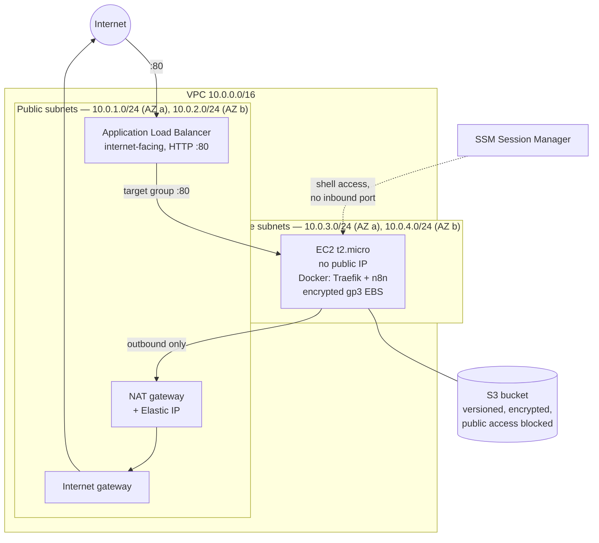

# AWS VPC + ALB + private EC2 (Terraform)

A two-tier network where the workload never has a public address. An
internet-facing Application Load Balancer sits in public subnets and forwards to
an EC2 instance in a private subnet, which reaches the internet outbound through
a NAT gateway and is administered through SSM Session Manager — no SSH keys, no
bastion, no inbound path to the instance at all.

The workload it was built for is a self-hosted [n8n](https://n8n.io) instance
running under Docker with Traefik, but nothing in the infrastructure is specific
to it.

---

## Architecture



The instance has no public IP and no security group rule reachable from outside
the VPC. The only way in is the load balancer for traffic and Session Manager for
administration — and Session Manager is an outbound connection from the instance
to the SSM service, so it opens no port at all.

## Modules

| Module | What it creates |
|---|---|
| `network` | VPC, two public and two private subnets across two AZs, internet gateway, NAT gateway with Elastic IP, and the route tables that keep the private subnets egress-only |
| `sg` | Security group for the instance, plus an optional customisable one driven by variables |
| `ec2` | Instance with encrypted gp3 EBS, user data that installs Docker and brings up the compose stack, and — when `enable_ssm` is on — the IAM role and instance profile for Session Manager |
| `s3` | Bucket with versioning, server-side encryption, public access blocked and an SSL-only bucket policy |
| `cloudfront` | Written but **not wired into `main.tf`**. See the gaps below. |

The ALB, its security group, target group and listener are declared in the root
module rather than in a module of their own.

## Cost

Rough monthly estimate for `us-east-1` at the defaults. Check the AWS Pricing
Calculator for current numbers.

| Item | Monthly |
|---|---|
| NAT gateway (hourly) | ~USD 33 |
| Application Load Balancer (hourly) | ~USD 16 |
| EC2 `t2.micro` | ~USD 8 |
| 20 GB gp3 EBS | ~USD 2 |
| Data processing on NAT and ALB | usage-based |
| **Total** | **~USD 59/month** |

Worth stating plainly: **the NAT gateway is the single largest line item**, more
than the compute it serves. For one instance whose only outbound needs are
package updates and the SSM agent, interface endpoints for SSM plus a gateway
endpoint for S3 would remove most of that cost and most of the egress surface at
the same time. Keeping the NAT is the convenient choice, not the cheap one.

## Known gaps

Listing these rather than leaving them to be discovered:

- **The listener is HTTP only.** The load balancer's security group accepts 443,
  but no HTTPS listener exists, so traffic between the client and the ALB is
  unencrypted. Fixing it needs an ACM certificate and a `443` listener, with `80`
  redirecting to it.
- **The instance security group allows the VPC CIDR, not the ALB.** Its own
  comment says `temp - will be restricted to ALB`. Referencing the load
  balancer's security group instead of a CIDR block is the correct form and is
  what the sibling [aws-rds-terraform](https://github.com/Mfdemenezes/aws-rds-terraform)
  repository does.
- **CloudFront is written but not enabled.** The module exists; the call in
  `main.tf` is commented out. In front of an HTTP-only origin it would also be
  the natural place to terminate TLS.
- **The compute is single-AZ.** The network spans two availability zones and the
  ALB is attached to both, but there is one instance in one subnet and no auto
  scaling group, so an AZ failure takes the service down. The network is ready
  for it; the compute tier is not.
- **The Traefik dashboard runs with `--api.insecure=true`** on port 8080. Only
  reachable from inside the VPC, but it should not be exposed at all.

## Usage

```bash
terraform init
terraform plan
```

State lives in S3 (`terraform-state-marcelo-menezes`). CI authenticates to AWS
through OIDC and assumes a role that can read and plan but cannot create
resources, so no pull request can provision infrastructure. Applying is a
deliberate, manual `workflow_dispatch`.

Connect to the instance without opening anything:

```bash
aws ssm start-session --target <instance-id>
```
